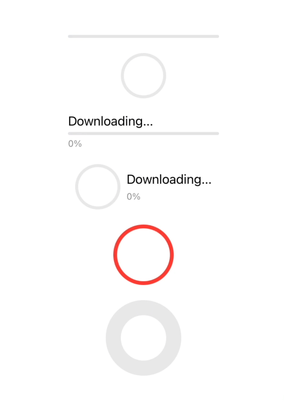

# RingProgressViewStyle

This is a library that adds a ring style to SwiftUI's `ProgressViewStyle`. The default apperance is based on the `.linear` style of `ProgressViewStyle`, but you can customize colors and a stroke style.

## Example

[ContentView.swift](./Sources/Showcase/ContentView.swift)



## Motivation

The `.circular` style already exists in `ProgressViewStyle`, but it's just an indicator, not a progress bar. So basically, you have to implement that by yourself.

Fortunately, if you google "SwiftUI progress ring", you can see a number of code examples. Almost all of them looks like:

```swift
Circle()
    .trim(from: 0, to: value)
    .stroke(...)
    .rotationEffect(.degrees(-90))
```

However, when you try to specify its size by `.frame(width: ..., height: ...)`, its stroke line overflows its frame.

To prevent this, I often use `strokeBorder` instead of `stroke`.

```swift
Circle()
    .trim(from: 0, to: value)
    .strokeBorder(...)
    .rotationEffect(.degrees(-90))
```

But it occurs a compilation error because `trim` returns `some Shape` that doesn't conform to `InsettableShape` but `strokeBorder` is a method of `InsettableShape`.

So I created a solution.

## Supported Platforms

- iOS 14+
- macOS 11+
